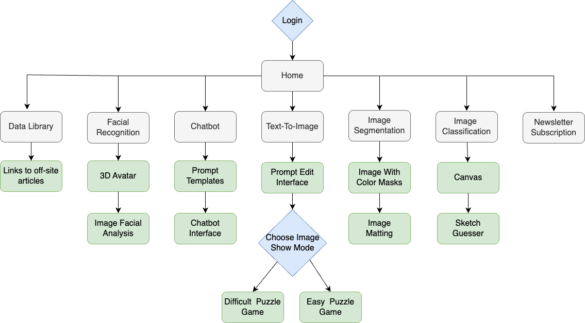
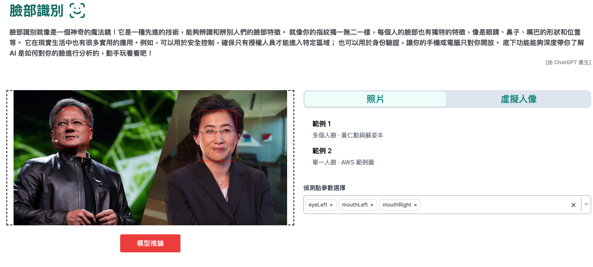
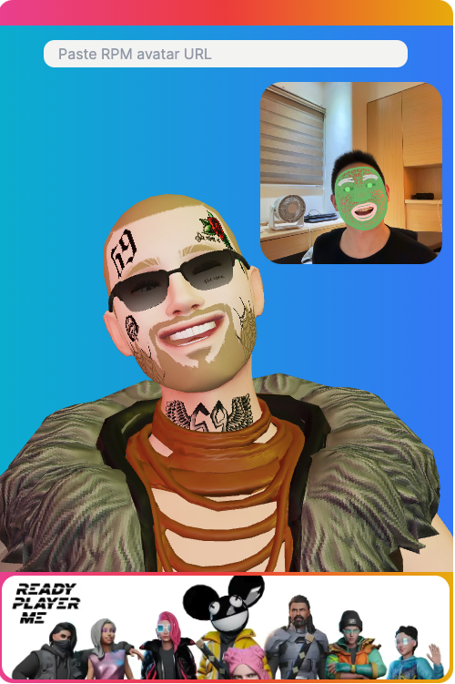
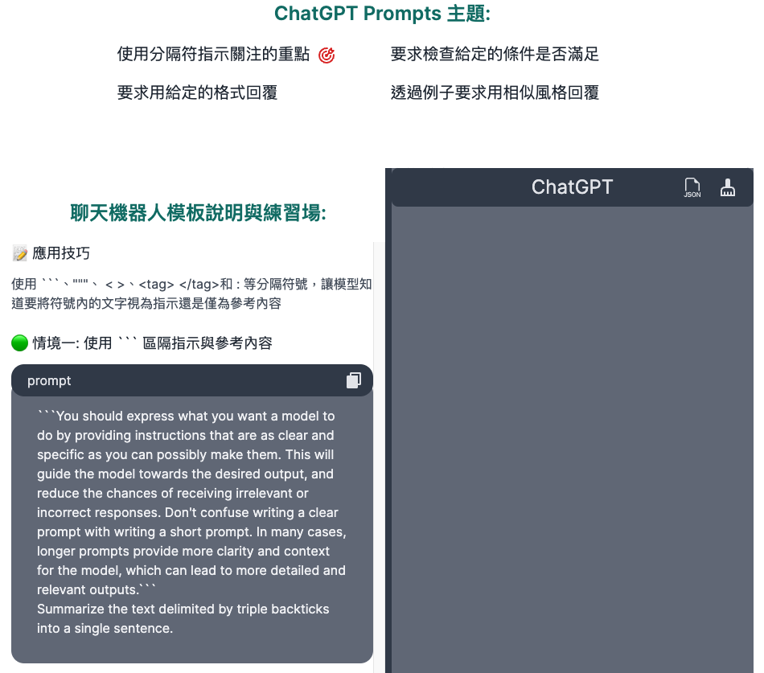
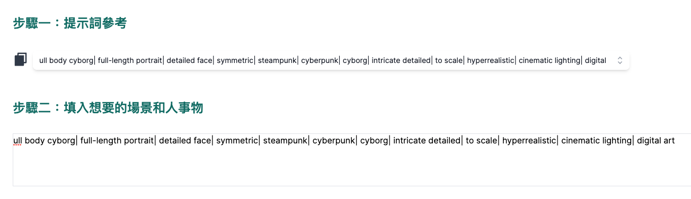
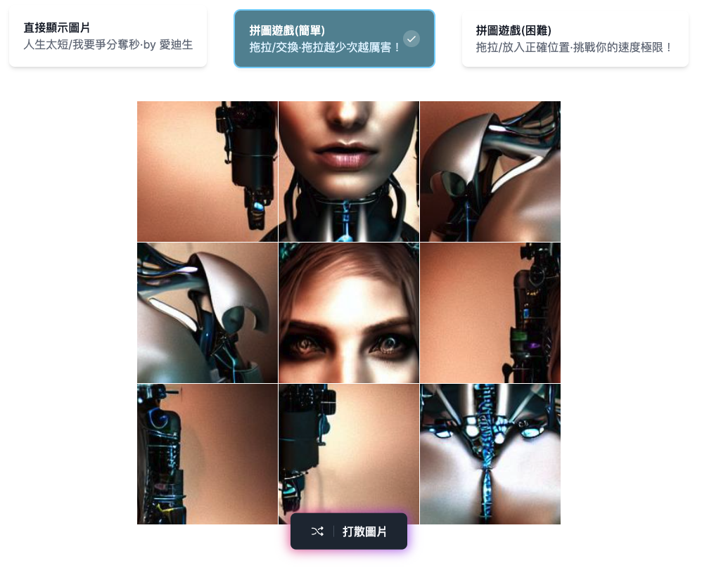
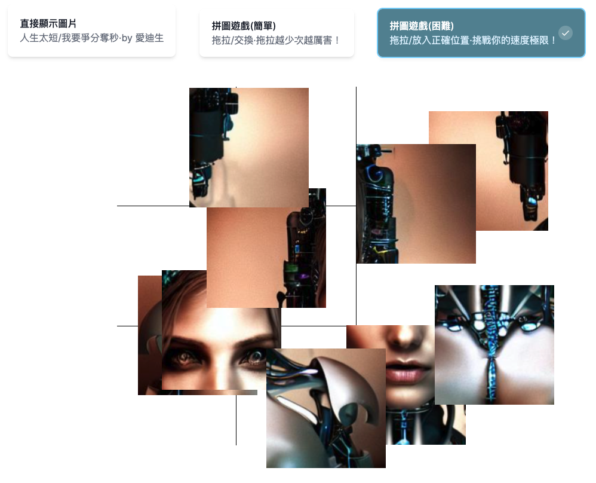
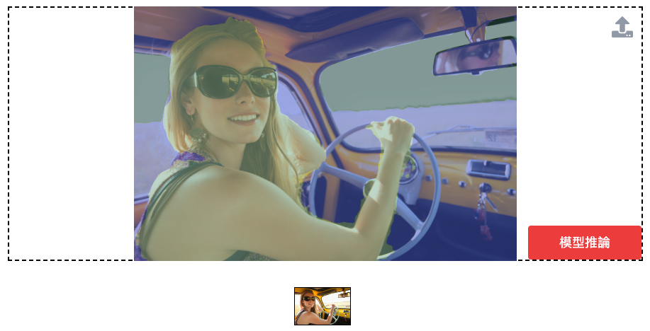
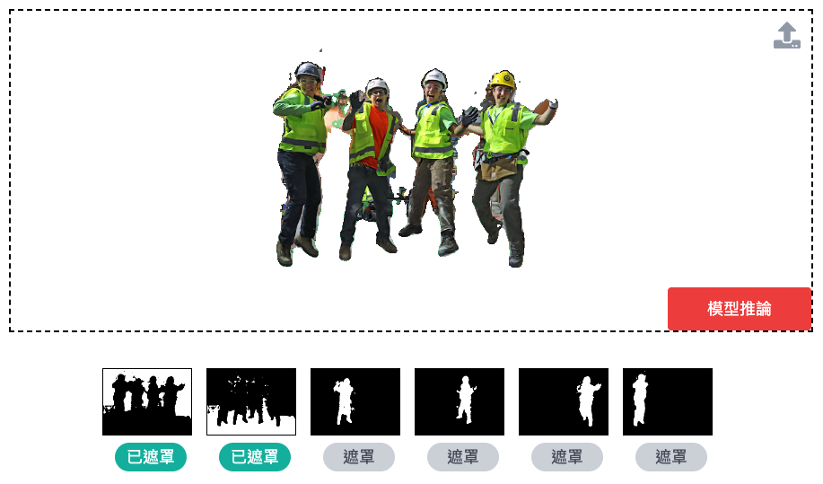
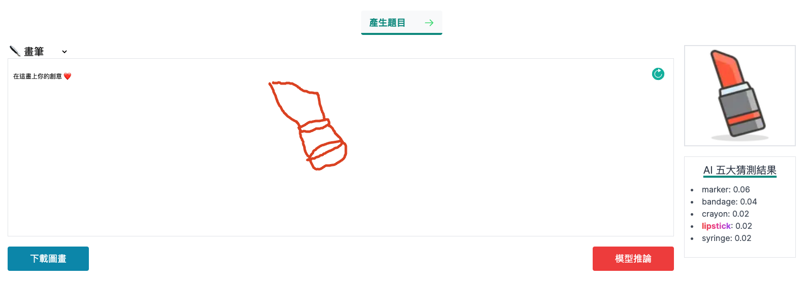

  
  

  

    <a href="https://github.com/EricTsai83/thing-ai-can-do# About">About</a>
    |
    <a href="https://github.com/EricTsai83/thing-ai-can-do# Flow chart">Flow chart</a>
    |
    <a href="https://github.com/EricTsai83/thing-ai-can-do# Demo">Demo</a>
  

# Things AI Can Do
An interactive AI website that demonstrates the capabilities of AI and enables users to understand practical applications of AI through hands-on interactions.

## About
Combined AI technology with a user-friendly front-end interface. The leading technologies used in this project include TypeScript, Tailwind CSS, Next.js, and Amazon web services such as Lambda, Amplify, and API Gateway.

## Flow chart

## Demo
### Facial Recognition
* Integrated AWS Lambda, API Gateway, and ML services to develop a facial recognition API to let user can interact with the website.

	
	

* Used three.js in combination with facial recognition technology to create a 3D virtual avatar application.

	

### ChatBot (ChatGPT)
* Integrated ChatGPT to build the chatbot feature on the website.
* Created a tutorial with sample prompts to teach people how to use Chatbot efficiently.

	

### Text to Image
* Created the user interface to write an image description and generate an image by the AI model.

	

* Designed puzzle games to increase the fun and engagement of the website.

	
	

### Image segmentation
* Employed visualization techniques to make users know how the model performs object segmentation within the images.

	

* Utilized image segmentation techniques to achieve image background removal functionality.

	

### Image Classifier
* Draw the scratch and let AI model inference.

	

